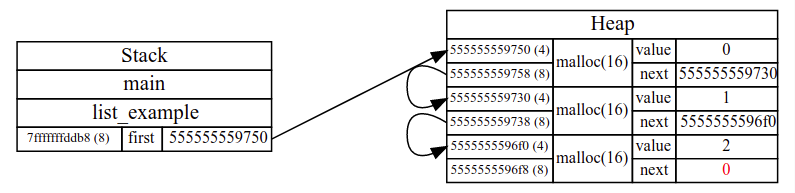

## visualize-c-memory

Real-time visualization of the memory of a C program during debugging in VSCode,
using [vscode-debug-visualizer](https://github.com/hediet/vscode-debug-visualizer)
and [GDB's Python API](https://sourceware.org/gdb/current/onlinedocs/gdb/Python-API.html).





### To try it

- Install graphviz.
  ```
  sudo apt install graphviz
  ```

- In VSCode, install [vscode-debug-visualizer](https://github.com/hediet/vscode-debug-visualizer).
  ```
  Ctrl-P / ext install hediet.debug-visualizer
  ```

- Clone this repository, open it in VSCode and start debugging (`F5`).

  If the debugger doesn't start, make sure that `gdb`, `make` and VSCode's [ms-vscode.cpptools](https://marketplace.visualstudio.com/items?itemName=ms-vscode.cpptools) are installed.

- Select `F1 / Debug Visualizer : New View` and
  write `"memory"` (__including__ the quotes) in the visualization window
  that opens.

- A visualization of both the stack and the heap will appear, and it will
  update as you step through the code (`F10`, `F11`, etc).

- [`examples/examples.c`](examples/examples.c) contains standard C code, you can modify it freely.

Tested in Ubuntu 20.04 and Windows 10 under WSL.


### To use it in your own programs

- Link your code with `visualize-c-memory/malloc-wrapper.c`
- Pass the following to gcc when linking. This allows to watch the heap by wrapping `malloc` calls.
  ```
  -Wl,--wrap=malloc -Wl,--wrap=realloc -Wl,--wrap=calloc -Wl,--wrap=free
  ```
- Run `source visualize-c-memory/visualize-c-memory.py` when GDB launches (see [launch.json](.vscode/launch.json)).


